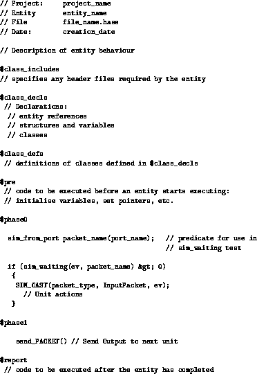

### Entity Code Structure

Most projects are simulations of sychronous systems in which the entities are clocked. The [Clocks](<synclib.md>) section describes the built-in clocking mechanisms available in HASE. The code example below, which shows the general structure of the Hase++ code for an entity, assumes that the entity is part of a system using a [two-phase clock](<synclib.md#biclocked>).

Following an initial documentation section (as comments marked off by //), there is an include section (\$class\_includes) which specifies any external files required by the entity, a declaration
section (\$class\_decls) containing declarations of entity references, structures, variables and classes, and a section for definitions of declared classes (\$class\_defs).

The \$pre section contains code to be executed before the simulation proper starts, *e.g.* initialisation of variables (all variables, classes, *etc* must be declared in the declarations section at the start of the file [see note 1 below]) and the setting of pointers to other entities.



Since this is a two-phase clocked system, the definition of each clocked entity will include the following:

<tt>EXTENDS (Biclocked)</tt>

where "Biclocked" is an abstract entity which registers the entity to be clocked with the appropriate pre-defined clock entity. This clock sends *phase 0* and *phase 1* clock signals to the clocked entities and receives "done" signals back from them once they have completed their actions in each phase.

The statements <tt>\$phase0</tt> and <tt>\$phase1</tt> in the entity's .hase file act as include statements for the code in the "clocked" entity which interacts with the clock entity.

In phase 0 an entity typically tests for the presence of an input packet from another entity, reads an input packet (<tt>SIM\_CAST(packet\_type, InputPacket, ev);</tt>) and carries out its internal actions in response.  In the case of a processor pipeline unit, for example, this will involve decoding the instruction in some way, using classes in the global functions files. The global function files *global\_fns.h* and *global_fns.c* are accessible from all entities. They contain, respectively, function prototype defintions and the corresponding C++ code for these functions. In phase 1, entities normally send packets to their successor units ready to be read at the next phase 0 clock signal.

It is sometimes useful, particularly when debugging code, to execute a print statement (the result of which appears in the Output panel) showing the start of each clock cycle and the cycle number. The following code fragments shows how this can be done:

```
$class_decls
 int cycle;
 Clock* MyClock;
$pre
 MyClock = (Clock*) sim.get_entity( sim.get_entity_id( "CLOCK" ) );
$phase0
 cycle = MyClock->cycle / 2;
 printf("Starting clock cycle %d\n", cycle);
```
Note the "/ 2", which is required because this is a two-phase clock.
<hr>
[1] Hase++, as a superset of C++ allows declaration within the body section, unlike Java: in an earlier phase of the HASE project a translator was used to convert HASE models into JavaHASE and the translator needed the Hase++ code to be Java compatible. Although this constraint no longer applies, it is considered good practice in HASE to stick with this rule.
