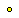
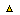
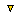
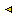
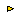

<a name="top"></a>
## Screen Layout

The screen layout in HASEIII is defined in an Entity Layout File containing information related to an entity (position, states, ports and parameters) and to a link (link corner positions) when displayed on screen.

An Entity Layout File contains a list of lines each of which should have one of the following formats:

- object_id : [POSITION](<#position>) (x,y,z) 
*info1 info2 info3*
- object_id : [STATES](<#states>) state1\_name gif\_image1 state2\_name gif\_image2 ...
- object_id : [PORT](<#elf-port>) port\_name SIDE entity\_side POSITION port\_position
*position_string ICON icon_file*
- object\_id : [PARAM](<#elf-param>) param\_name MODE mode\_name  POSITION (param\_x,param\_y)
- object\_id : [LINKCORNER](<#corners>) src\_entity src\_port dest\_entity dest\_port no\_of\_corners *(cx1,cy1) ...*
- [bottomcorner](<#bottom>) : position (x,y)

where **object_id** can be either an entity name (which has been declared in the entity library) or a component name defined as a CHILD of a COMPENTITY or as an AENTITY STRUCTURE.

<hr>

Note: The syntax given for the parts of the entity layout file may run onto a second line, however when creating a layout file, the part being specified, for example, a port's position, must not contain any new line characters in the specification.

<a name="position"></a>
## Entity Layout: POSITION

### Synopsis 

The POSITION declaration provides a mechanism for positioning entities in the project view panel.

### Syntax 

```
point_2d ::= ( x , y )

point_3d ::= ( x , y , z )

entity_position ::= object_id : POSITION point_2d [ infoX ] [ infoY ] [ layout_order ]
  | object_id : POSITION point_3d [ infoX ] [ infoY ] [ layout_order ]
```

 -  **object_id**  *str* - The name of the entity to be positioned. This can be the type name of an entity defined in the entity library, in which case the same coordinates will be given to all the entities of that type. It can also be the instance name of the required entity. The instance name should be the complete hierarchical name.  When specifying a level name from the hierarchy, the instance name, not the type name, should be used. Each level in the hierarchy should be separated by a '.',  *i.e.* the syntax for a complete hierarchical name is: 

**top\_level\_instance\_name.next\_level\_name. ... .last\_level\_name}**. 

The position given to an instance overrides the position information of the library component.

 -  **x**  *int* - The x coordinate of the top left corner of the entity's icon. This coordinate is relative to the top left corner of the project view panel for top level entities. For child entities of a compound entity it is relative to the upper left corner of the parent entity's icon. 

The x coordinate may also be a string. In that case the string has to be the name of one of the parameters specified for the related entity. Then the position of the icon will change when the value of the parameter is changed.

 -  **y**  *int* - The y coordinate of the top left corner of the entity's icon. This coordinate is relative to the top left corner of the project view panel for top level entities. For child entities of a compound entity it is relative to the upper left corner of the parent entity's icon. 

The y coordinate may also be a string. In that case the string has to be the name of one of the parameters specified for the related entity. Then the position of the icon will change when the value of the parameter is changed.

 -  **z**  *int* - The z depth of the entity's icon. This optional parameter maybe used to modify the render order of entities. If unspecified, the z coordinate will default to '0' (considered to be the front of the screen). A high value z will push the entity deeper into the screen. For child entities the z coordinate is relative to the parent entity.
 

 -  **infoX, infoY, layout_order**  *str*
Some entities ( *e.g.* meshes) have up additional items of layout information.

### Example 

<tt> Memory\_Hierarchy.secondary\_cache : POSITION (100,50)</tt>

[<- top](<#top>)

<a name="states"></a>
### Entity Layout: STATES

### Synopsis

The STATES declaration provides a mechanism for associating a gif image with a particular state of an entity.

### Syntax

object\_id : STATES state1\_name gif\_image1 state2\_name gif\_image2 ...

- **object_id** *str* - The name of the entity. This can be the type name of an entity defined in the entity library, in which case the state will be associated with all the entities of that type. It can also be the instance name of the required entity. The instance name should be the complete hierarchical name.  When specifying a level name from the hierarchy, the instance name, not the type name, should be used. Each level in the hierarchy should be separated by a '.', *i.e.* the syntax for a complete hierarchical name is:

**top\_level\_instance\_name.next\_level\_name. ... .last\_level\_name**.
- **state1\_name ***str* - One of the states defined in the ENTITY declaration.
- **gif_image1** * str* - The gif image to be associated with state1. HASE looks for this file in the project's *bitmaps* (image repository) subdirectory, then in HASE's own internal image repository.
If it cannot be found in either, the HASE default_ent.gif image is used. If no state is defined or no image is associated with a state, the name of the entity (not of the instance) is used to find the gif image.

### Example

Entity definition:

```
ENTITY memory  (
 DESCRIPTION ("Memory")
 STATES (M_IDLE, M_READ, M_WRITE)
 ...
        );
```

Entity layout:

```
MEMORY : position (350,30)
MEMORY : STATES M_IDLE:memory M_READ:mem_read  M_WRITE:mem_write
...
```
[<- top](<#top>)

<a name="elf-port"></a>
## Entity Layout: PORT

### Synopsis

The PORT declaration provides a mechanism to position a port on any side of an entity and at any point along the specified side.

### Syntax

<tt>object\_id : PORT port\_name SIDE entity\_side POSITION port\_position position\_string ICON icon\_file</tt>

- **object_id** *str* - The name of the entity with which the port is associated.  This can be the type name of an entity defined in the entity library, in which case the port will be positioned on all the entities of that type. It can also be the instance name of an entity. The instance name should be the complete hierarchical name.  When specifying a level name from the hierarchy, the instance name, not the type name, should be used. Each level in the hierarchy should be separated by a '.', *i.e.* the syntax for a complete hierarchical name is:  
**top\_level\_instance\_name.next\_level\_name. ... .last\_level\_name**  
The port information given to an instance overrides the port information of the library component.

- **port\_name** *str* - The name of the port to be positioned.
- **entity\_side** *str* - The name of the side of the entityon which the port is to be positioned. This should be
**TOP**, **BOTTOM**, **LEFT** or **RIGHT**.
- **port\_position** *int* - The number of pixels along the specified side on which the port is to be positioned. The number of pixels is relative to the top of the entity's icon for ports on the **LEFT** or **RIGHT**, and relative to the left of the entity's icon for ports on the **TOP** or **BOTTOM**. The value determines the position of the centre of the port and not the top/left.
- **icon\_file** *str* - The icon file used to represent the port. HASE first looks for this file (icon_file.gif) in the project's image repository directory (declared in the PREAMBLE), then in HASE's own image repository, which has five entries:


portdot:  &nbsp; portu:  &nbsp; portd:  &nbsp; portl:  &nbsp; portr: 

If no icon file is specified, the default is *portdot*. In addition, specifying *portblank* means that no port icon is drawn.

### Example

<tt>REGISTERS : port input side BOTTOM position 45 ICON portu</tt>

[<- top](<#top>)

<a name="elf-param"></a>
## Entity Layout: PARAM

### Synopsis

The PARAM declaration provides a mechanism for displaying a parameter and specifying its position.

### Syntax

<tt>object\_id : PARAM param\_name MODE mode\_name POSITION (param\_x,param\_y)</tt>

- **object_id** *str* - The name of the entity that is associated with the parameter.  This can be the type name of an entity defined in the entity library, in which case the parameter will be positioned on all the entities of that type. It can also be the instance name of the required entity. The instance name should be the complete hierarchical name.  When specifying a level name from the hierarchy, the instance name, not the type name, should be used. Each level in the hierarchy should be separated by a '.', *i.e.* the syntax for a complete hierarchical name is:
**top\_level\_instance\_name.next\_level\_name. ... .last\_level\_name**
The param information given to an instance overrides the param information of the library component.
- **param\_name** *str* - The instance name of the parameter to be displayed.
- **mode\_name** *str* - This specifies how the parameter is to be displayed.  This can be one of the following:
  -  **VALUE**: displays the parameter's value; it is updated as it changes through the animation.
  -  **NAME\_VALUE**: displays the parameter's name as well as its value.
  -  **ENT\_ICON**: allows enumerated parameters to be used to change the icon of the entity depending upon the parameter's state.
 -  **PORT\_ICON**: allows enumerated parameters to be used to change the icon of a port depending upon the parameter's state.
- **Parameter position** - Where a parameter is drawn on the screen depends on its [modifier](<entity.html#modifier>) *i.e.* on whether or not it is *static*.
**Non-static parameters** are drawn as follows:
  - **param\_x** *int*, **param\_y** *int* specify the x and y coordinates of the position where the value of parameter is to be displayed. They are relative to the top left corner of the icon of the associated entity, *e.g.* a value of 0,0 will cause the parameter to be displayed at the top left hand corner of the entity.
**Static parameters** are drawn as follows:
  - **param\_x** *int*, **param\_y** *int* specify the x coordinate of the position to display both the name and the value of the parameter. They are relative to the top left corner of the screen.

### Example

<tt>Memory\_Hierarchy.secondary\_cache : PARAM cache\_size MODE VALUE POSITION (50,0)</tt>

[<- top](<#top>)

[<- Userguide](<Userguide.md>)
