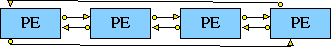

## MESH1D - 1-dimensional array of entities

### Synopsis

The **MESH1D** constructor is a special type of COMPENTITY which creates a 1-dimensional array of copies of a (previously defined) entity.
*e.g.*



### Syntax

```
MESH1D [OBJECT] name (
					ENTITY_TYPE ( entity_type )
					SIZE1( size )
					NO_LINKS( 1 | 2 )
						*WRAP( 0 | 1 )*
					DESCRIPTION( "description" )
					PARAMS( *ref_parameters, ...* )
					)
```

- **name** *str* - The name of the array to be created.
- **entity_type** *str* - The type name of the entity to be used to create the array.  The entity must have at least two or four(depending upon the number of links) ports and must have previously been defined in the [entity library](<entitylib.html>).
- **size** *int* - The number of entities in the array.
- **no_links** *1 or 2* - This is indicates whether two links or one should be used to connect together the entities. If one link is required, the entity must have at least one source port and one destination port. If two links are required then the entity to be used should have at least two source ports and two destination ports.
- **wrap** *0 or 1* - This is used to indicate whether the two end entities in the array should be joined together. A 1 indicates that they should, and a 0 that they shouldn't. If this component is omitted then it is assumed to be 0.
- **description** *str* - A description of an aspect of the array entity created.
- **ref_parameters** - This section of the 1-dimensional array entity definition describes the parameters that are associated with it.  See [reference parameters](<parameters.md>).

### Links Between Entities

The ports (SOURCE, DESTINATION) of the basic entity are used to generate automatic links between generated entities.  For each entity, the first DESTINATION port is connected to the first SOURCE port of the previous entity. If no_links equals 2, then a second link is created from the second SOURCE port of the current entity to the second DESTINATION port of the previous entity.

### Example

The 4 processing element mesh shown above was produced using the following
definitions:<p>

```
ENTITYLIB (
 ENTITY PE1 (
			  DESCRIPTION ("Processing Element")
			  STATES (PE1_NORMAL)
			  PARAMS ()
			  PORTS (
			 		PORT ( to_right, l_int, SOURCE)
					PORT ( from_right, l_int, DESTINATION)
					PORT ( to_left, l_int, SOURCE)
					PORT ( from_left, l_int, DESTINATION)
					)
			 );
MESH1D simd1 (
			  ENTITY_TYPE (PE1)
			  SIZE1 (4)
			  NO_LINKS(2)
			  WRAP(1)
			  DESCRIPTION("1-dimensional array")
			  PARAMS()
			 )
)
STRUCTURE (
AENTITY		simd1 SIMD1 (DESCRIPTION("1D SIMD") )
)
```

### Screen Layout

Some of the screen layout information is generated automatically. Thus the forwarding SOURCE ports are set to be graphically displayed on the right of the child entities for horizontal meshes, or on the bottom for vertical meshes.  The backward SOURCE ports (if no_links equals 2) are displayed on the left of the child entities for horizontal meshes, or on the TOP for vertical meshes (and vice-versa for DESTINATION ports).

When the wrap flag is set, the [LINKCORNER](<corners.md>) information is also generated.

Some optional information may also be added after the position information in the project definition, an integer specifying the spacing between the CHILD entities and HORIZONTAL (the default) or VERTICAL to indicate the dimension into which the child entities are to be expanded, *e.g.* for the example given above, the layout definition is:

<tt>SIMD1 : position (20,30) 90</tt>

### Entity Names

Entities generated in this example are named:

<tt>PE1\_0\_, PE1_1\_, ... , PE1\_SIZE1-1\_</tt>

[<- Entity Library](entitylib.md)
