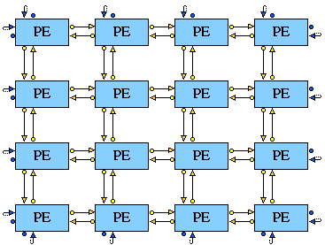

## MESH2D, MESH3D, MESH4D, ... - Multi-dimensional arrays of entities

### Synopsis

This construct is similar to the [1-D Mesh Entities](<mesh1.md>) construct but with more than one dimension. For example, the **MESH2D** constructor is a special type of COMPENTITY which creates a 2-dimensional array of previously defined CHILD entities, *e.g.*



### Syntax
```
MESHdimD name (
ENTITY_TYPE ( entity_type )
SIZE1( size1 ) SIZE2 ( size2 ) ... 
NO_LINKS( 1 | 2 )
WRAP( 0 | 1 )
DESCRIPTION( "description" )
PARAMS( ref_parameters, ... )
)
```

- **dim** *int* - The dimension of the mesh.
- **name** *str* - The name of the array to be created.
- **entity_type** *str* - The type name of the entity to be used to create the array.  The entity must have previously been defined in the entity library.  
- **sizeX** *int* - The number of entities in the Xth dimension.
- **no_links** *1 or 2* - This is indicates whether two links or one should be used to connect together the entities. If one link is required, the entity must have at least dim SOURCE ports and dim DESTINATION ports. If two links are required then the entity to be used should have at least dim*2 SOURCE ports and dim*2 DESTINATION ports.  
- **wrap** *0 or 1* - This is used to indicate whether the two end entities of each dimension should be joined together. A 1 indicates that they should, and a 0 that they shouldn't. If this component is omitted then it is assumed to be 0.
- **description** *str* - A description of an aspect of the array entity created.
- **ref_parameters** - This section of the dim-dimensional array entity definition describes the parameters that are associated with it.  See [reference parameters](<parameters.md>).

### Port names and links:

In order to select which port of an entity will be connected to which port of which neighbour entity, the following policy is applied:

The ith SOURCE port of an entity will be connected to the ith DESTINATION port of the closest following entity through the ith dimension.

When no\_links=2, the (dim+i)th SOURCE port of an entity will be connected to the (dim+i)th DESTINATION port of the closest preceding entity through the ith dimension.

### Links Example
 
In the Mesh2D example below:  

The 1st SOURCE port (to\_right) is connected to the 1st DESTINATION port (from\_left) of the closest following entity through the 1st dimension (x). As no_links = 2, the (dim+1 = 3)rd SOURCE port (to\_left) is connected to the 3rd DESTINATION port (from\_right) of the closest preceding entity through the 1st dimension.  

The 2nd SOURCE port (to\_bottom) is connected to the 2nd DESTINATION port (from\_top) of the closest following entity through the 2nd dimension (y). As no\_links = 2, the (dim+2 = 4)th SOURCE port (to\_top) is connected to the 4th DESTINATION port (from\_bottom) of the closest preceding entity through the 2nd dimension. Thus PORTs should be declared as matching pairs in cyclic SOURCE order, *i.e.* right, bottom, left, top.

### Screen Layout

Some of the screen layout information is generated automatically. Thus the forwarding SOURCE ports in a 2-dimensional array are set to be graphically displayed on the right of the child entities in the X (horizontal) direction, or on the bottom in the Y (vertical) direction.  The backward SOURCE ports (if no\_links equals 2) are displayed on the left of the child entities in the X direction, or on the TOP in the Y direction (and vice-versa for DESTINATION ports).

When the wrap flag is set, the [LINKCORNER](<corners.md>) information is also generated.

Some optional information may also be added after the position information in the project definition, a set of integers specifying the spacing between the CHILD entities in each of the dimensions.

### Mesh2D Example

The 4x4 processing element mesh shown above was produced using the following definitions:

```
ENTITYLIB (
ENTITY PE2 ( 
			DESCRIPTION ("Procesing Element")
			STATES (PE2_NORMAL)
			PARAMS ()
 			PORTS (
					PORT ( to_right, l_int, SOURCE)
					PORT ( to_bottom, l_int, SOURCE)
					PORT ( to_left, l_int, SOURCE)
					PORT ( to_top, l_int, SOURCE)
					PORT ( from_left, l_int, DESTINATION)
					PORT ( from_top, l_int, DESTINATION)
					PORT ( from_right, l_int, DESTINATION)
					PORT ( from_bottom, l_int, DESTINATION)
					)
		);
MESH2D simd2 ( 
				ENTITY_TYPE (PE2)
				SIZE1 (4)
				SIZE2 (4)
				NO_LINKS(2)
				WRAP(1)
				DESCRIPTION("2-dimensional array")
				PARAMS()
				)
)
STRUCTURE (
AENTITY simd2 SIMD2 (DESCRIPTION("2D SIMD")
)
```

### Screen Layout

```
SIMD2 : position (20,30) 90 70
```

### Entity Names

Entities generated in this example are named:<p>

\_0\_0_ &nbsp; \_1\_0\_ &nbsp; \_2\_0\_ &nbsp; \_3\_0\_  
\_0\_1\_ &nbsp; \_1\_1\_ &nbsp; \_2\_1\_ &nbsp; \_3\_1\_  
\_0\_2\_ &nbsp; \_1\_2\_ &nbsp; \_2\_2\_ &nbsp; \_3\_2\_  
\_0\_3\_ &nbsp; \_1\_3\_ &nbsp; \_2\_3\_ &nbsp; \_3\_3\_

The first number is the coordinate in the first dimension, the second is the the coordinate is the second dimension (*etc.* for more dimensions).

[<- Defining a Project](project.md)
