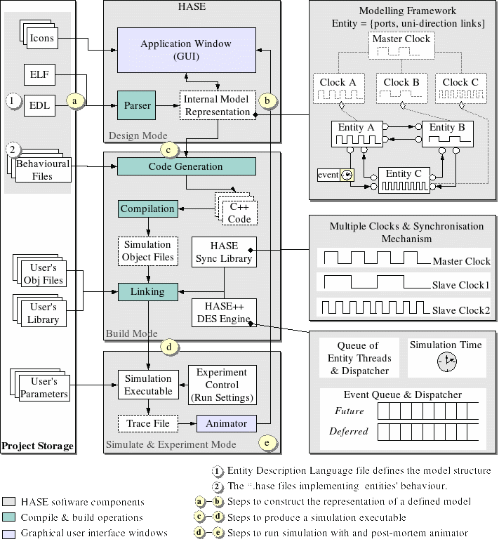

## System Overview

HASE uses three types of file to specify a simulation: an Entity Description Language file (project.edl), an Entity Layout File (project.elf) and Hase++ (entity.hase) files.

The EDL file describes the components of the architecture (entities), their ports and parameters, the links between them and any hierarchical structure (in essence the *logical* structure of the experiment).

The ELF file contains information relevant to the *physical* display, *i.e.* where components and ports are positioned on the screen, and any variables to be displayed. When creating the display, HASE also uses .gif icons to represent the components on screen.

The Hase++ files specify the behaviour of each of the entities.

### Building the Executable

The figure below shows the process used by HASE to convert the EDL and Hase++ files into an executable simulation.

The EDL file specifies the entities to be used to construct the system to be simulated, which tells HASE which behaviour files are required for the simulation.  The relevant Hase++ files are then converted into C++ files, as well as generating a project C++ and header file.  These files are then compiled to form the simulation executable.  When the Simulation Executable is run, HASE also uses user-supplied values for the Parameters.

### Simulation

During a simulation run, HASE writes an event sequence into an event Trace File and this trace can subsequently be played back to provide the user with a visual display of activity in the system.  The trace is produced automatically from the simulation model without the need for the user to write explicit animation code.

### Animation

The Animator allows the user to check that the model produces correct results.  Activity in the simulation model is visualised in a variety of ways, *e.g.* through moving icons showing data packets passing between components in the design window, by changes to a component's icon to reflect its current state and by the changing contents of registers and memories in the Project Inspector panel.

[<- Userguide](<Userguide.md>)
