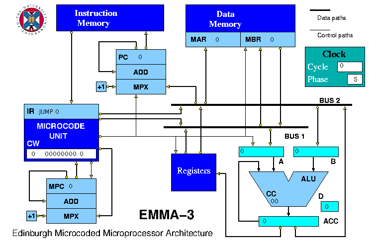

## Defining a Project

A typical HASE project consists of a number of entities connected together by links attached to ports belonging to the entities, as shown in the project screen image below.

Most entities also have a set of parameters, *e.g.* a memory entity includes an array parameter which models the actual memory component within the entity.

The project definition file is structured as follows:  

project ::= PROJECT (  
&nbsp; &nbsp; &nbsp; [PREAMBLE](<preamble.md>)  
&nbsp; &nbsp; &nbsp; [PARAMLIB](<paramlib.md>)  
&nbsp; &nbsp; &nbsp; &nbsp; &nbsp; &nbsp; [Reference Parameters](parameters.md)  
&nbsp; &nbsp; &nbsp; &nbsp; &nbsp; &nbsp; [Initialising Parameters](rparam.md)  
&nbsp; &nbsp; &nbsp; &nbsp; &nbsp; &nbsp; [Initialising Arrays](arrays.md)  
&nbsp; &nbsp; &nbsp; [GLOBALS](<globals.md>)  
&nbsp; &nbsp; &nbsp; [ENTITYLIB](<entitylib.md>)  
&nbsp; &nbsp; &nbsp; [STRUCTURE](<structure.md>)  
  )  
[<- Userguide](<Userguide.md>)

