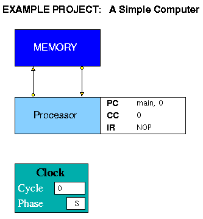

The Simple Computer project consists of a Processor and a Memory.  The Memory contains two arrays to hold instructions and data (instr\_mem and data\_mem), while the Processor contains a single array forming the programmable registers (main\_reg). The Processor instruction set, defined in s-comp.edl, contains simple load/store and register-register arithmetic instructions together with a Jump Immediate, a Jump Register and a Branch instruction. The outcome of the branch instruction is determined by a Condition Code (CC) register set according to the result of one of six possible comparisons between two register values. There is also a No Operation (NOP) instruction and a STOP instruction.

Along with the Condition Code register, the Program Counter (PC) and Instruction Register (IR) are displayed in the Project View panel. The Program Counter has two fields, a label (<tt>main</tt> in the
figure) and an offset (<tt>0</tt> in the figure), because the instruction array in the Memory is declared using the [ARRAYI](<paramlib.md#arrayi">) construct. 

The project is made up of the files listed below. These files illustrate many of the features of HASE described in the User Guide.

Definition files (HASE-III)
.md
- [s-comp.edl](sc-edl.md)
- [s-comp.elf](sc-elf.md)
 
Entity Behaviour files

- [proc.hase](sc-proc-hase.md)
- [memory.hase](sc-mem-hase.md)

Global Function files

- [global_fns.h](sc-global-h.md)

Register/Memory content files

- [PROC.main_reg.mem](sc-regs.md)
- [MEMORY.instr_mem.mem](sc-i-mem.md)
- [MEMORY.data_mem.mem](sc-d-mem.md)

[<- Userguide](Userguide.md)
